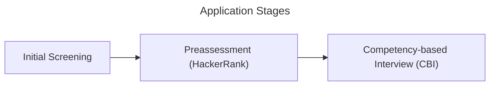
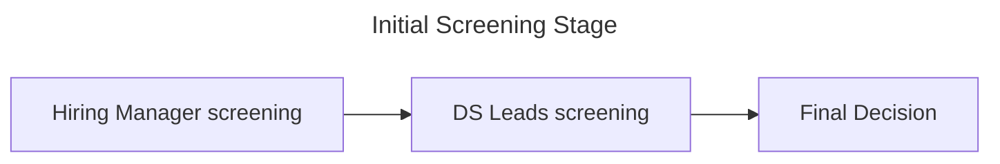
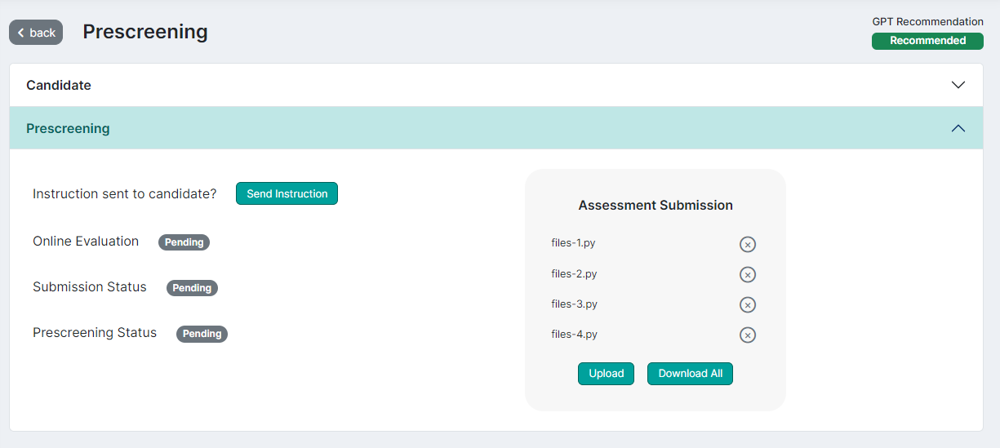
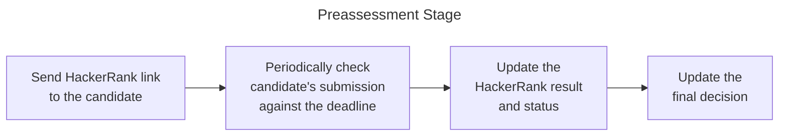
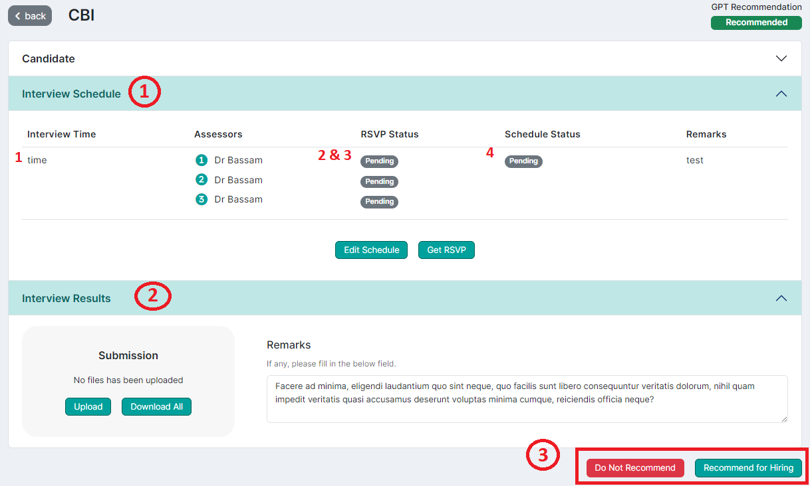
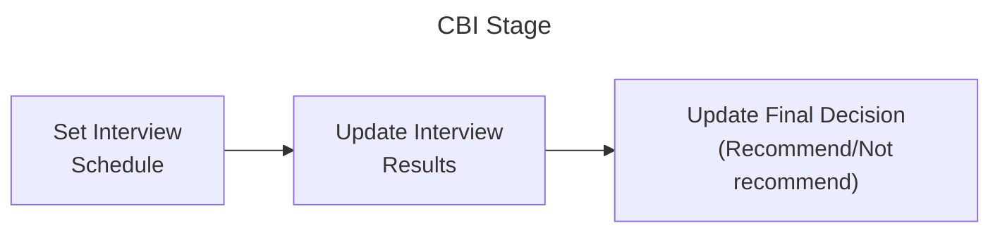

# Applicant Tracking System (ATS) 

[](http://forthebadge.com)

<!-- [](https://badge.fury.io/py/Django)
[](https://github.com/athityakumar/colorls/actions/workflows/ruby.yml) -->

One of the core components in the integrated architecture of the Recruitment NWoW/process re-engineering, **Applicant Tracking System (ATS)** is a web-based application envisioned to serve as a one-stop center for recruitment activities within DS department. The app is designed to handle the tracking of applicants and various automations associated with routine processes throughout the application.

The app is powered by **[Django](https://docs.djangoproject.com/en/4.2/intro/) framework** (backend) along with traditional **HTML/CSS/JavaScript** stack in the frontend. Therefore, intermediate knowledge of Python & Django framework may be an advantage to work with the source code.

This *readme.md* aims to provide an overview of the system, installation and build steps, as well as the documentation of the source code as part of the project handover.  
<br>

# Table of contents
<details open>
<summary>Enlarge the details for the complete TOC</summary>

- [Applicant Tracking System (ATS)](#applicant-tracking-system-ats)
- [Table of contents](#table-of-contents)
- [Local Installation](#local-installation)
- [Overview of ATS](#overview-of-ats)
  - [*Candidate Browse/List* page](#candidate-browselist-page)
  - [*Application Stage* pages](#application-stage-pages)
    - [Initial Screening](#initial-screening)
    - [Preasssement](#preasssement)
    - [Competency-based Interview (CBI)](#competency-based-interview-cbi)
- [Deployment via Azure Pipeline in DevOps](#deployment-via-azure-pipeline-in-devops)
</details>
<br>

# Local Installation

[(Back to top)](#table-of-contents)

*Note that this guideline uses **git bash** as the CLI erminal to execute commands*

1. `git clone` the project repo into any preferred directory in your local environment
2. Open CLI and navigate to the project directory:
    ```sh
    # navigate to project directory
    cd path/to/directory 
    ```
3. Set-up a virtual environment for the project repository. There are multiple ways to achieve this. If you are familiar with *Conda* or any other tools, you can proceed with creating an environment in Conda. Otherwise, you may follow the below steps to create an environment using ***Venv***.
    
    1. Install Python (preferably, version >= 3.9).
    2. Open the project directory in CLI (make sure the CLI is navigated to the project's root directory) and execute the following commands:
        
        ```sh
        cd path/to/directory
        
        # create environment
        python -m venv .venv
        
        # activate environment (cmd)
        .venv/scripts/activate
        
        # activate environment (git bash)
        source .venv/scripts/activate
        ```

4. Install the required dependencies as in the `requirements.txt` file.

    ```sh
    pip install -r requirements.txt
    ```

5. Now that the project environment is ready, it's time to initiate the database creation and run the development server.

    Run the following commands to create (and migrate) database:

    ```sh
    cd recruitment

    # Create any new database migrations
    python manage.py makemigrations

    # Commit the migrations into the database (db.sqlite)
    python manage.py migrate
    ```

6. Finally, run the development server as follows:
    ```sh
    python manage.py runserver
    ```

    Access the ATS via the localhost url e.g. `http://localhost:8000/` 

<br>

# Overview of ATS

[(Back to top)](#table-of-contents)

At this point, you should be able to access the ATS running in the development server. In short, the `runserver` command allows the developers to test and debug their app by running in the local server. Every changes made to the app will be imediately reflected in the browser wihout the need to set up a production server.

As of now, ATS entails 5 functioning web pages dedicated for the full tracking capability of the candidates' application. The following explanations briefly describe their respective functions and key components embedded in the section.

## *Candidate Browse/List* page

<details open>
<summary>Expand/collapse details</summary>
<br>


As the name suggests, this page is initially dedicated to displaying the overview/summary of all received candidates for DS department. Nevertheless, it has been gradually developed to embed CRUD functionalities to modify the application status of the candidates. The intention is that the hiring manager/execs can instantly manipulate the status/information of the large volume of candidates from a single view.

The following numbered list explain the key components in the browse page:

1. **Upload Resume button**:

    Upon clicking the button, a modal dedicated to uploading resume(s) will appear that includes;  
    
      * `file input` field that accepts multiple file uploads
      * `source` dropdown field to specify the source of resumes
      * `upload` button to upload the resumes into the database. 
      * `upload and parse` button which alternatively redirects the user to *Parse Resume* modal dedicated to uploading and parsing the resumes in one continuous flow.

    <br>
   
2. **Parse Resume button**:
   
    Upon clicking the button, a modal dedicated to parsing new (uploaded) resume(s) will appear which includes;
    
    * **Count of resumes** to be parsed
    * Parser configurations input consisting of `job title` and `job description` fields to match the candidates with specific applied position
    * `Parse Resumes` button to trigger the resume parsing process
    * `Save configuration` checkbox to save the newly edited `job title` and `job description` when clicking the `Parse Resumes` button
    
    <br>

3. **GPT Score Threshold Filter**:

    Each candidate is associated with a certain value of **GPT score** which is derived from the resume parsing process. The `threshold` sets the minimum value/percentage for the score that which filters out candidates in the table that meet the condition. The `toggle` either enables or disable the GPT Score threshold filter

4. **Source Filter**: Filters out the candidates that are received from a selected source

5. Table Filters: Filters out the candidates based on the selected value in specific column(s)

    ***For `Received Date` column, the `date input` sets the *starting value* of the range , which means the filtered received date will be from *inputted date --> current date*

6. **Status dropdowns**: The users can utilize the `dropdown` to update the application status for each applicant
    
    *Technical note: Upon the value change of the dropdown, the relevant event sends an API call in the background to the server to update the status of the stage. Then, the table is refreshed to reflect the latest change.*

</details>

## *Application Stage* pages

<details open>
<summary>Expand/collapse details</summary>
<br>

There are **three stages** that the candidate must undergo throughout the application process, as depicted by the process flow below:



### Initial Screening<hr>


The initial screening stage involves 3 phases, depicted by by the process flow below:


<br>

1. In the first phase, the hiring manager (HM) reviews and assesses the information of the candidates (extracted from the resume). Once the decision is made, HM updates the **Hiring Manager Screening** status whether to proceed or reject the candidate. If `status = proceed`, the process continues to the 2nd phase, otherwise (`status = not proceed`) the application is not continued.

2. The second phase requires decision from other DS leads (managers) in the **DS Lead Screening** section whether to proceed with the candidate. This mainly works like a vote in which the user can select relevant **checkbox(s)** and vote to proceed or reject the candidate. Please note that this part of the system is very much a work-in-progress. The current view, as illustrated in the below snippet, is intended for the hiring manager only. Ideally, the view of DS Lead Screening for other managers should only include an interface to vote for the particular candidate on his/her behalf only, <span style="color:red;">although this specific view is not yet developed</span>. As a result, while the managers can access the section to cast a vote, each of the vote remains anonymous and is only seen by the hiring manager.

3. In the end, a majority vote is implemented to determine the status of the applicant, in which the status is reflected in the **Final Decision** section. Logically, the majority vote indicates the final status of this stage. However, should there be any rare occasions where the candidates are unable to proceed to the next stage, the hiring manager is allowed to update the final status in this last section.

### Preasssement<hr>



*Note: The system frontend is not yet integrated with the backend*

There are four activities involved in the preassessment stage (initially called as *Prescreening*), as illustrated by the process flow below:


<br>

1. Once the candidate passes the initial screening stage, ATS automatically sends an invitation link to join the assessment in HackerRank via the candidate's email.

2. Upon sending the email, ATS starts keeping track of the HackerRank submission by the candidate regularly, preferably on *a daily basis*. This can be done by integrating ATS with **HackerRank API** developed by Dr Bassam. ATS checks the timestamp of the submission against the assigned deadline (the date of the invitation email).

    In case of the candidate not submitting the assessment within the given period, ATS automatically rejects the candidate and assigns a specific status relating to failure to complete the assessment.

3. Once the candidate submits the assessment, the ATS fetches the result from HackerRank and stores the status and result into the database. ATS also displays the information in the section.

4. Finally, the hiring manager updates the status of the stage for the candidate.

### Competency-based Interview (CBI)<hr>



*Note: The system frontend is not yet integrated with the backend*

There are two phases in the CBI stage (initially called as *Prescreening*), as illustrated by the process flow below:


<br>
 
1. The first phase in the CBI stage is scheduling the interview session. There are four processes within this phase.

    ```mermaid
    ---
    title: Processes in Intervew Schedule
    ---
    flowchart LR
        set_iv["Set interview time 
        and assessors"]
        send_rsvp["Send RSVP to interview 
        assessors and candidate"]
        rsvp_status["Update RSVP 
        status"]
        iv_status["Update schedule 
        status"]
        set_iv --> send_rsvp --> rsvp_status --> iv_status
    ```
    <br>

   1. First step is to set the interview time and assessors(interviewees) involved in the interview. (This step is considered as 'interview is scheduled').
   
   2. Once the interview is scheduled, ATS sends RSVP to the candidate and assessors via email.
   
   3. Upon the RSVP response, ATS retrieves the RSVP responses and updates the RSVP status in the section.
   
   4. The user in-charge then updates the final status whether to continue or cancel the scheduled interview.
    
    <br>

2. After the interview is succcessfully conducted, the assessors update the interview results by uploading an evaluation form into ATS.

3. Finally, the hiring manager updates the status of the stage for the candidate whether to recommend or not recommend the candidate.

</details>

<br>

<!-- # Roadmap

[(Back to top)](#table-of-contents)

Content -->

# Deployment via Azure Pipeline in DevOps

[(Back to top)](#table-of-contents)

This section of documentation briefly elaborates on the deployment of ATS.

* The current git repository of ATS is called `applicant-tracking-system` which resides in `DS-Capability_Development` project in Azure DevOps.

* The branch used for the deployment is the `deploy_v1` branch. Changes from any other branch is merged into this production branch to take effect in the production environment.

    Please take note the difference of configuration in the app settings (`/recruitment/recruitment/settings.py`) between the production branch and local branch.

* The deployment of ATS takes place in Azure Pipeline via a pipeline created from a YAML file.
  
  `pipeline.yml` is specifically used to create the pipeline. It contains the required configurations that specify the build and deploy steps in the deployment process. The following bullet points summarizes key steps and options listed in the YAML file.

  * The details of provisioned resource assigned for the ATS are listed under **variables** option in which will be used in the last step of the deployment.

    Under **trigger** option, the  `deploy_v1` branch is specified which triggers the execution of pipeline for every changes pushed to the branch in the repository. This is known as continuous integration (CI) trigger. 
  
    ```yml
    variables:
    service_connection: 'dssandbox-spn'
    resource_group: 'PTAZSG-DEV-DSP-RG'
    app_name: 'ptsg-5dspwb04'
    slot_name: 'dstats'

    pool:
    vmImage: ubuntu-latest

    ## No code trigger (events )
    trigger: 
    branches:
        include:
        - deploy_v1
    ```    

  * The python version is specified for running the build steps.
  * In this step, the `requirements.txt` file is copied into the recruitment directory.

    <div>pipeline.yml</div>
    <div>.gitgnore</div>
    <div><span style="color:red;">requirements.txt</span> <-- (target file)</div> 
    <div>/recruitment</div>
    <div style="padding-left:20px"><span style="color:green">requirements.txt</span> <-- destination file</div>
    <br>            

    ```yml
    - task: CopyFiles@2
      displayName: "Copy requirements.txt into recruitment"
      inputs:
      SourceFolder: '$(System.DefaultWorkingDirectory)'  # Root folder
      Contents: 'requirements.txt'  # File to copy
      TargetFolder: '$(System.DefaultWorkingDirectory)/recruitment'  # Destination subfolder
    ```

  * Create a virtual environment in the recruitment folder and install required dependencies. Note the line `python3.9 manage.py collectstatic` which collect all static files into a single location  
    
    ```yml
    # Make a venv, activate, install requirements, run collectstatic
    - script: |
        cd recruitment
        python3.9 -m venv antenv
        source antenv/bin/activate
        python3.9 -m pip install --upgrade pip
        pip install -r requirements.txt
        echo "Dependencies installation completed"
        python3.9 manage.py collectstatic
        echo "Collectstatic completed"      
      workingDirectory: "$(System.DefaultWorkingDirectory)"
      displayName: "Install requirements"
    ```

  * The next two steps packages the directory into a zip file and publish it as an artifact to be used in the deploy step.

    ```yml
    # create zip file be deployed
    - task: ArchiveFiles@2
      displayName: "Archive files"
      inputs:
        rootFolderOrFile: "$(System.DefaultWorkingDirectory)/recruitment"
        includeRootFolder: false
        archiveType: 'zip'
        archiveFile: '$(Build.ArtifactStagingDirectory)/$(Build.BuildId).zip'
        replaceExistingArchive: true

    - task: PublishBuildArtifacts@1
      inputs:
        PathtoPublish: '$(Build.ArtifactStagingDirectory)/$(Build.BuildId).zip'
        artifactName: 'drop'
      displayName: 'Publish build artifacts'
    ```

  * The last step is the **deploy** step. The key component in this step is the `StartupCommand` which contains three seperate commands that are executed in a sequential order.
    
    1. `source antenv/bin/activate`: Activate the created virtual environment.
    2. `pip install -r requirements.txt`: Install the dependencies.
    3. `gunicorn --bind=0.0.0.0:8080 --timeout 600 recruitment.wsgi`: Run the production server via gunicorn.
    
    <br>

    ```yml
    # deploy zip package to azure app service
    - task: AzureRmWebAppDeployment@4
      inputs:
        ConnectionType: 'AzureRM'
        azureSubscription: $(service_connection)
        appType: 'webAppLinux'
        WebAppName: $(app_name)
        deployToSlotOrASE: true
        ResourceGroupName: $(resource_group)
        SlotName: $(slot_name)
        packageForLinux:  '$(Build.ArtifactStagingDirectory)/$(Build.BuildId).zip'
        # packageForLinux:  '$(Build.ArtifactStagingDirectory)/**/*.zip'
        RuntimeStack: 'PYTHON|3.9'
        DeploymentType: 'zipDeploy'
        StartUpCommand: "source antenv/bin/activate & pip install -r requirements.txt & gunicorn --bind=0.0.0.0:8080 --timeout 600 recruitment.wsgi"
        # StartUpCommand: "python manage.py runserver"
        AppSettings: '-Port 8080 -RequestTimeout "10:20:00" -WEBSITE_TIME_ZONE "Singapore Standard Time" -WEBSITES_PORT 8080 -WEBSITES_ENABLE_APP_SERVICE_STORAGE true -SCM_DO_BUILD_DURING_DEPLOYMENT true -ENABLE_ORYX_BUILD true'
        # timeoutInMinutes: 60 # Set the timeout to 60 minutes
    ```

<!-- # License

[(Back to top)](#table-of-contents)


The MIT License (MIT) 2017 - [Athitya Kumar](https://github.com/athityakumar/). Please have a look at the [LICENSE.md](LICENSE.md) for more details. -->
